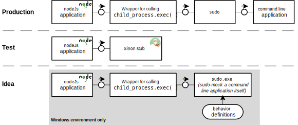

# exe-mock

Mocking a command line application

## Reasoning

While developing a nodeJs application which utilizes command line programs in the system I spent quite some time on an approach to mock node's [child_process.exec()](https://nodejs.org/api/child_process.html#child-process) for proper testing. In fact I did not get along a suitable approach for mocking but just created a wrapper and modularized this wrapper. Using [sinon](https://sinonjs.org/) I stubbed the call of the wrapper. 



Since I was developing on a Windows machine and all of the commands the node application should execute require [sudo](https://en.wikipedia.org/wiki/Sudo) I got the idea to create a mock for `sudo` itself which could be used on Windows environments. By doing so I would be possible to test the node application without utilities like [mocha](https://mochajs.org/) and [sinon](https://sinonjs.org/). It would be possible to just run the production code and mock the output of all 'sudoed'-commands.

During ideation I came across multiple other approaches which I would like to share here. All of them have been rejected.

- feeding the actual commands to be executed by the node application via a configuration file -> command injection in production possible
- conditional execution of commands: `sudo <command>` in case of production and `something else <command>` during test -> modification of production code for testing purposes (with all the risks and drawbacks that come along)

After using the sudo mock for some time I noticed that there is no reason to only mock a sudoed-command. It is possible to mock any command just by providing a corresponding executable.

## Build jar file

Using a maven build-run configuration a jar file can be built. Use goal `package`. 

## EXE-packaging

The actual source code is organized as maven project and will build a jar file. To wrap it into an executable [lauch4j](http://launch4j.sourceforge.net/) is used. The launch4j configuration is stored in `launch4j.xml`. The name of the output file needs to be adjusted according to your needs: `<outfile>.\<your-executable-mock>.exe</outfile>`

Note: When facing issues starting launch4j.exe due to missing JRE you might use `java -jar launch4j.jar` for launching.

## Usage & Configuration

Make sure a JSON-file named `behavior.json` is stored at the same directory as `<your-executable-mock>.exe`. This file needs to have the following structure:

```
[
	{
		"default": [
			{
				"command": "help",
				"output": "read the manual!"
			},
			...
		]
	}, 
	{
		"<name>": [
			{
				"command": "help",
				"output": "read the manual again!"
			},
			...
		]
	},
	...
]
```

The `default` entry along with its subsequent definitions is used in case the environment variable `TEST_CASE` is not set. In case environment variable `TEST_CASE` is set the corresponding branch in `behavior.json` is read.

Example: You would like the exe-mock to output some success message for command `cp a b` by default. In case the environment variable `TEST_CASE` is set to `errorCase1` there should be an error message. Hence, `behavior.json` is defined as follows:

```JSON
[
	{
		"default": [
			{
				"command": "a b",
				"output": "copy successful"
			}
		]
	}, 
	{
		"errorCase1": [
			{
				"command": "a b",
				"output": "copying failed: no such file 'a'"
			}
		]
	}
]
```

The exe-mock will behave as follows:

```
> cp a b
copy successful

> set TEST_CASE=errorCase1 && cp a b
copying failed: no such file 'a'

> cp a b
copying failed: no such file 'a'

> set TEST_CASE=default

> cp a b
copy successful
```

## Issues

* File `behavior.json` does not exist or is not located in the same directory as `<your-executable-mock>.exe`. In this case you will get error message `File 'behavior.json' not found! This file must be located in the same directory.`. Create a file named `behavior.json`. You might want to copy the same available in this repository.
* File `behavior.json` does not contain a specific command (e.g. `ABC`). In this case you will get error message `No definition found for command 'ABC' in behavior.json!`. Edit file `behavior.json` and an object like the following one:
```JSON
	{
		"command": "ABC",
		"output": "some output"
	},
```

* File `behavior.json` does not contain any definition for a certain command (e.g. `ABC`). In the case you will get error message `For command 'ABC' property 'output' is NOT defined! Correct behavior.json first!`. Edit file `behavior.json` and add a property `output` on the JSON-object of the respective command. The property name must be `output`(as already mentioned). The property's value can be any valid JSON (e.g. string, object, ...).

## Restrictions

* The command **must not** contain the following characters: `<` `>`